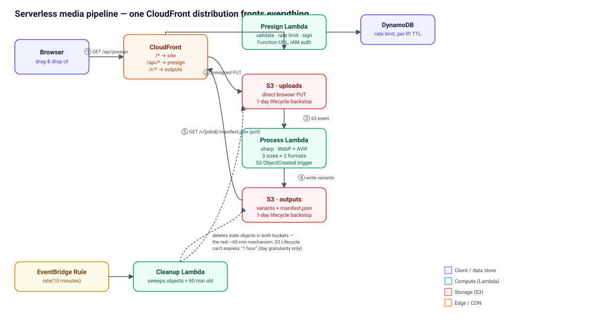

# AWS Media Pipeline

Serverless image-optimization pipeline on AWS — drop an image, get WebP/AVIF
variants back in seconds, generated by a Lambda pipeline you can watch work.
The file never touches a server of ours: it goes straight from your browser
to S3 via a presigned URL. Built as Level 06 of
[jabordones.com](https://www.jabordones.com).

**Status:** infrastructure, Lambdas, and frontend are built and fully tested
(73 tests, `npm test`). Not yet deployed — that's the one step that needs a
real AWS account and isn't run automatically. See [Deploying](#deploying).

## Architecture



One CloudFront distribution fronts everything, so the app is same-origin
end to end:

| Path | Origin | Cache |
|---|---|---|
| `/*` (default) | S3 site bucket (the Vite build) | standard |
| `/r/*` | S3 outputs bucket (variants + `manifest.json`) | standard, except `manifest.json` itself: zero-TTL |
| `/api/*` | Presign Lambda (Function URL, OAC) | zero-TTL |

**Flow:**
1. Browser calls `GET /api/presign?fileName=...&contentType=...&sizeBytes=...`
   — validated, rate-limited by IP (DynamoDB), returns a presigned PUT URL
   and a `jobId`.
2. Browser `PUT`s the file directly to the uploads bucket. Nothing touches
   an application server we run.
3. That `ObjectCreated` event triggers the process Lambda, which writes an
   early `manifest.json` with `status: "processing"` before doing any work,
   then uses `sharp` to generate 6 variants (480/1024/1920px × WebP/AVIF,
   never upscaling past the source), and finally overwrites the manifest
   with `status: "ready"` (or `"error"`, with a message — never left
   hanging).
4. Browser polls `GET /r/{jobId}/manifest.json` through CloudFront until it
   sees a terminal status.
5. An EventBridge rule runs a cleanup Lambda every 10 minutes, deleting
   anything older than 60 minutes from both buckets.

## Design decisions

**S3 Lifecycle cannot expire objects after "1 hour" — this is not a
simplification, it's a hard platform limit.** `Expiration` rules only
support whole-day granularity (CDK throws at synth time on anything else),
and even a 1-day rule only evaluates once per day. The actual ~60-minute
deletion is a plain `EventBridge` rate rule (`rate(10 minutes)`) invoking a
sweeper Lambda that deletes anything past its age threshold in both
buckets — declared in the CDK stack like everything else, so `cdk destroy`
still leaves nothing behind. Each bucket also carries a 1-day `Expiration`
rule as a backstop in case the sweeper ever fails. This was deliberately
chosen over per-job [EventBridge Scheduler](https://docs.aws.amazon.com/scheduler/)
one-time schedules (which would delete more precisely, at exactly the
60-minute mark) because schedules created imperatively by Lambda code at
runtime aren't tracked by CloudFormation — a worse fit for a project whose
own acceptance bar is "`cdk destroy` leaves nothing behind."

**Rate limiting behind CloudFront needs the forwarded viewer address, not
the Lambda's own `sourceIp`.** A Function URL sitting behind CloudFront
sees CloudFront's own edge IP as the request's source — the real visitor
address only exists in the `CloudFront-Viewer-Address` header, which has
to be explicitly forwarded via an `OriginRequestPolicy`. Rate limiting
without this would silently do nothing.

**The presign endpoint is `GET` with query params, not `POST` with a JSON
body.** CloudFront's Origin Access Control signs requests to a Lambda
Function URL using SigV4, which for a request with a body requires a
precomputed `x-amz-content-sha256` — awkward to do correctly from a
browser. A `GET` has no body, so the problem doesn't need working around,
it just doesn't come up.

**The presigned `PutObjectCommand` deliberately does not sign
`ContentType`.** Browsers aren't perfectly consistent about what
`Content-Type` header they attach to a raw `PUT`, and if it were part of
the signature, any mismatch fails the upload with `403
SignatureDoesNotMatch`. Instead, the process Lambda determines the real
format authoritatively by sniffing the downloaded bytes with `sharp(...).metadata()`
— independent of whatever the browser claimed at upload time.

**`sharp` is bundled via Docker (`NodejsFunction` + `forceDockerBundling`),
not a hand-maintained Lambda Layer.** This was tested empirically rather
than assumed: the build machine is Apple Silicon, so a `linux/arm64` Docker
build runs natively (no QEMU emulation), and `cdk synth` confirmed it
produces the correct `@img/sharp-linux-arm64` native binary. This avoids
tracking a separately-built layer's compatibility with the exact sharp/Node
version by hand.

**CloudFront's OAC grant for the presign Function URL needs two IAM
permissions, not the one CDK adds automatically.**
`FunctionUrlOrigin.withOriginAccessControl` only grants
`lambda:InvokeFunctionUrl`. AWS's Lambda Dual Authorization model — which
also requires `lambda:InvokeFunction` for the same caller — starts being
enforced **2026-11-01**; both grants are added explicitly in
`infra/lib/constructs/distribution.ts` rather than relying on the L2
default.

**403/404 responses are cached for zero seconds.** `manifest.json` doesn't
exist until the process Lambda writes it, and CloudFront caches 404s for
10 seconds by default regardless of what the origin says — enough to make
polling flicker. Both the error-caching TTL and the `manifest.json`
behavior's own cache policy are forced to zero.

**No `X-Frame-Options`, ever — and no CloudFront managed "security
headers" preset either**, because those presets bake in `X-Frame-Options: DENY`,
which would silently break the embed from www.jabordones.com no matter what
the CSP says. The bespoke `ResponseHeadersPolicy` sets only
`frame-ancestors 'self' https://www.jabordones.com https://jabordones.com`.

**Downloads force `Content-Disposition: attachment` on the S3 object
itself**, set when the process Lambda writes each variant — not via a
signed query-string override, and not via a plain `<a download>` in the
frontend. The portfolio site's iframe embed sandboxes with
`allow-scripts allow-same-origin allow-forms allow-popups allow-popups-to-escape-sandbox`,
which has no `allow-downloads`; a plain `<a download>` would be silently
blocked. Setting the header on the object works regardless of the sandbox,
combined with `target="_blank"` on the frontend's link.

**IAM is scoped by action and key prefix throughout** — no
`bucket.grantReadWrite()`. The presign Lambda can `PutObject` under
`uploads/*` and `UpdateItem` on the rate-limit table only; the process
Lambda can `GetObject` under `uploads/*` and `PutObject` under `r/*`; the
cleanup Lambda gets `ListBucket` (bucket-level, no way to scope by prefix
when it has to discover every job) and `DeleteObject`, and nothing else.

## Cost estimate

At portfolio-scale traffic (~500 uploads/month is a generous assumption):

| Service | Free tier | Estimated usage | Cost |
|---|---|---|---|
| Lambda | 1M requests + 400,000 GB-s/month, permanent | ~1,500 invocations, ~2,050 GB-s (AVIF encoding dominates) | ~$0 |
| CloudFront | 1 TB egress + 10M requests/month, permanent | a few hundred MB, ~10,000 requests | $0 |
| DynamoDB | 25 GB + 25 RCU/WCU, permanent (on-demand billing here regardless) | ~500 conditional writes | ~$0.001 |
| S3 storage | Free tier is time-limited for newer accounts | <1 GB resident at any moment — nothing lives past ~70 minutes | ~$0.02 |
| S3 requests | Same caveat as above | ~500 PUT (uploads) + ~3,500 PUT (6 variants + manifest × ~500 jobs) + ~2,500 GET (polling, downloads) | ~$0.02–0.05 |
| **Total** | | | **well under $0.10/month** |

No always-on resources. The only genuinely time-limited free tier here is
S3's — worth being honest that it isn't perpetual for every account
vintage — but at this volume the actual dollar cost is sub-cent either way,
since almost nothing is ever resident for more than an hour.

## Repository layout

```
aws-media-pipeline/
├── infra/                  CDK app (TypeScript)
│   ├── bin/app.ts
│   ├── lib/media-pipeline-stack.ts
│   ├── lib/constructs/     buckets, rate-limit table, each Lambda, distribution
│   └── test/               CDK assertions (Template.fromStack)
├── lambdas/
│   ├── presign/            validate, rate limit, client-IP parsing, handler
│   ├── process/            image variants, manifest, handler
│   └── cleanup/            staleness check, handler
├── web/                    Vite + TypeScript frontend (no framework)
└── docs/architecture.svg
```

Every pure-logic module (`variants.ts`, `manifest.ts`, `validate.ts`,
`rateLimit.ts`, `clientIp.ts`, `stale.ts`, `format.ts`, `api.ts`'s
`pollManifest`) is unit-tested without touching AWS. Handlers are tested
with `aws-sdk-client-mock` against real `sharp` output (synthetic fixture
images, not mocked image processing) rather than mocking the one thing
most worth testing for real.

## Developing

Prerequisites: Node.js 22+, Docker (for Lambda bundling — confirmed to run
natively on Apple Silicon, no QEMU needed for `linux/arm64`), and an AWS
account with credentials configured for the deploy step only.

```bash
npm install          # installs every workspace (infra, lambdas/*, web)
npm test              # unit tests + CDK assertions, ~15-20s (Docker bundling included)
npm run typecheck     # tsc --noEmit across every workspace
npm run --workspace web dev      # local frontend dev server
npm run --workspace web build    # production build, output in web/dist
```

## Deploying

```bash
aws configure                       # or an SSO profile — needs credentials once
cd infra
npx cdk bootstrap                   # one-time per account/region
npx cdk deploy                      # stands up everything: buckets, table, 3 Lambdas, distribution
```

`cdk deploy` prints `SiteUrl`, `DistributionId`, and the three bucket names
as stack outputs. Upload `web/dist/` to the site bucket
(`aws s3 sync web/dist s3://<SiteBucketName>`) and invalidate the
distribution's `/*` path after any frontend change.

```bash
npx cdk destroy                     # tears down cleanly — no manual cleanup steps
```

## Acceptance criteria

- [ ] Upload a 5 MB JPEG → WebP + AVIF variants in 3 sizes with visible savings, in seconds — needs a live deploy to verify
- [x] Files >10 MB or of a disallowed type are rejected both at presign and in the process Lambda (authoritatively, via `sharp` sniffing)
- [ ] Objects disappear from both buckets after ~60-70 minutes — needs a live deploy to verify (sweeper interval + margin)
- [ ] `cdk deploy` stands up everything from scratch with no manual steps; `cdk destroy` leaves nothing behind — CDK-validated via assertions; not yet run against a real account
- [ ] Embeddable in an iframe from another origin — CSP `frame-ancestors` configured and asserted in tests; needs a live deploy to confirm in a real browser
- [x] README with diagram, decisions, and costs; tests pass (`npm test`, 73/73 green)
